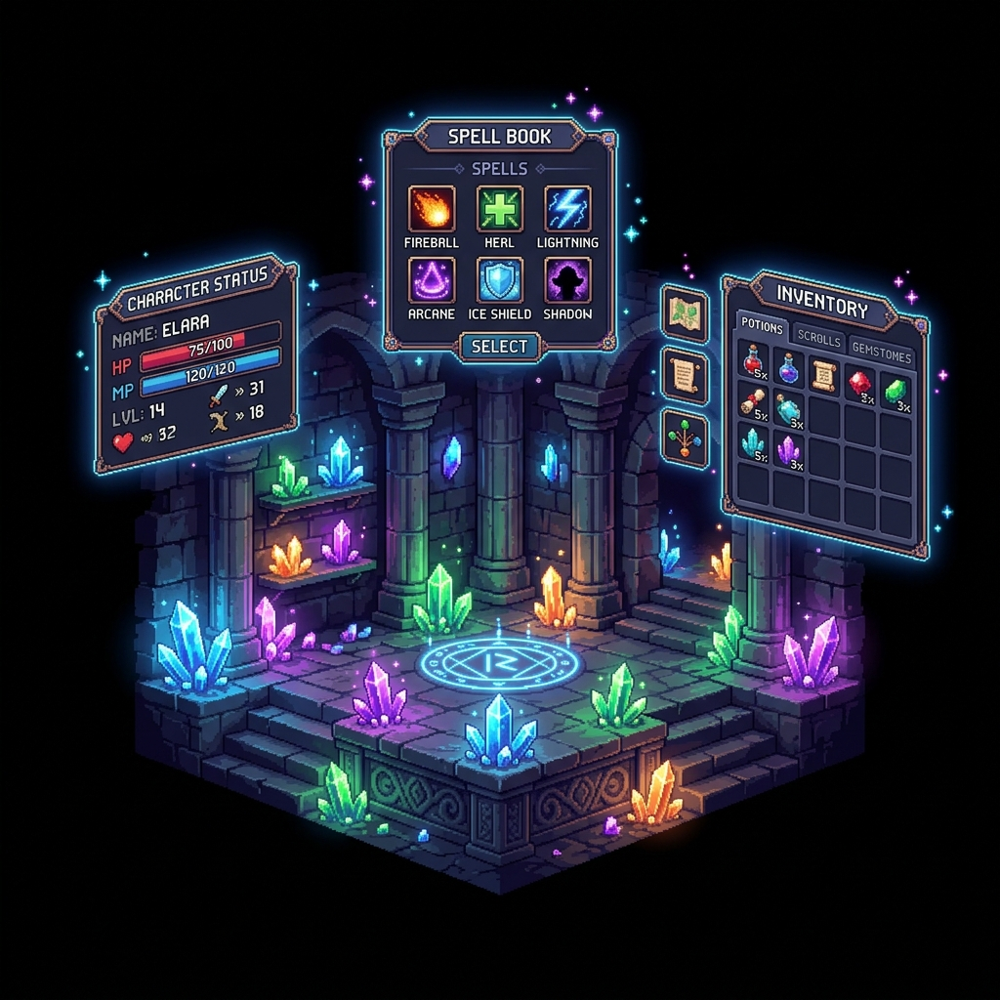
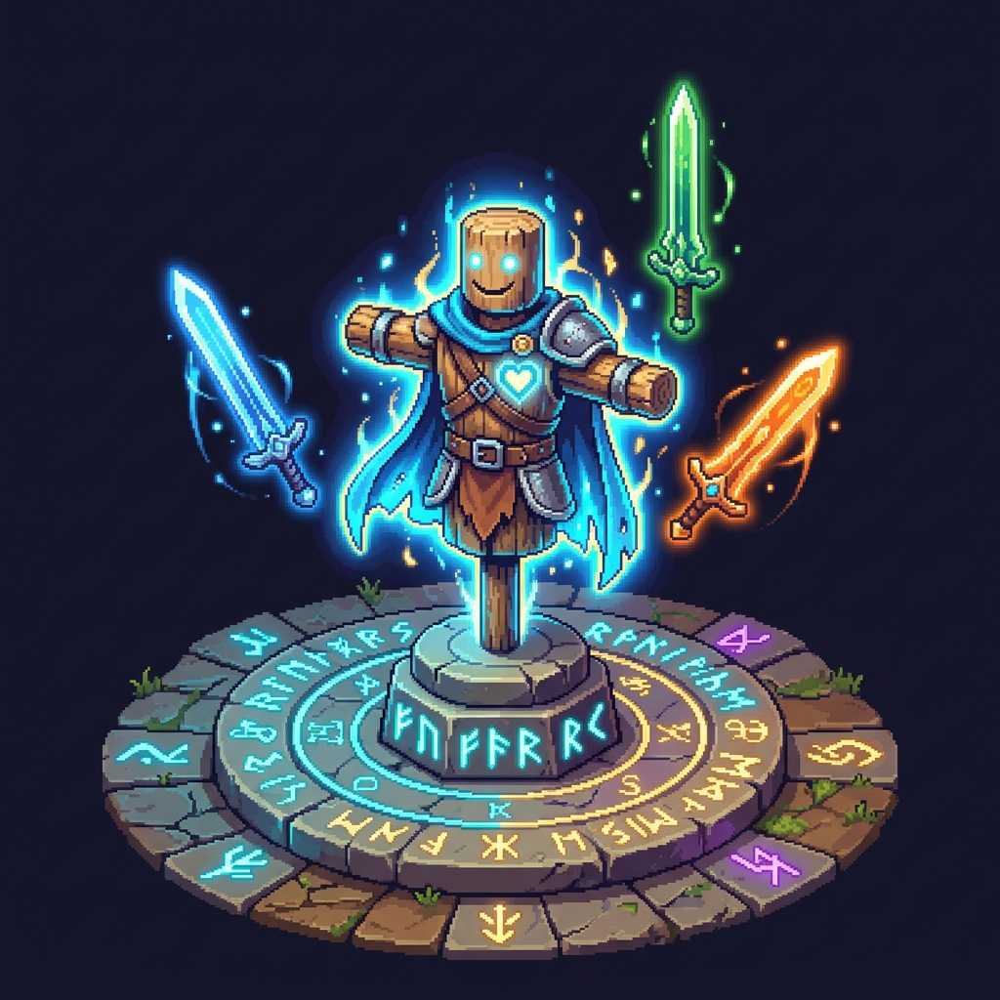
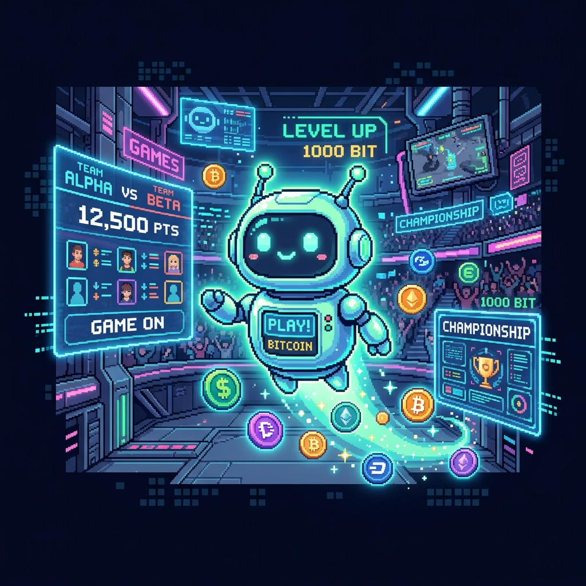

# CodeQuest: Advanced Gamified Learning Platform

CodeQuest is a next-generation, immersive learning platform designed to make mastering programming an engaging and gamified experience. It features multiple visual themes, robust role-based dashboards, a dynamic rules engine for achievements, and a variety of learning modes ranging from structured curriculums to competitive team arcades.

## Key Features

### 1. Immersive Thematic Learning Environments
- **Multi-Theme Architecture:** Seamlessly switch between entirely different UI aesthetics.
  - **Classic:** Clean, modern, and professional utility-based styling.
  - **God of War (Uncharted Territories):** Dark, runic typography with deep red gradients and mythological aesthetics.
  - **Spider-Man (Multiverse Anomalies):** Futuristic, neon-blue and red styling featuring dynamic decals.

### 2. Comprehensive Curriculum & Challenges
- **Learn Catalog:** Interactive coding courses across various languages (JavaScript, Python, Rust, Go, C++, Ruby).
- **Practice Arena:** Sharpen skills with coding challenges. Supports dynamic sorting and filtering to find the perfect difficulty level.
- **Guided Projects:** Step-by-step project studio for building real-world applications with built-in IDE features.

### 3. Gamification & Progression System
- **Global Rankings & Leaderboards:** Compete with learners globally. Track progress, level, XP, and streaks.
- **Achievement Trigger Rules Engine:** A fully dynamic backend engine that evaluates user actions against configured thresholds to award achievements and badges.
- **Team Arcade & Battles:** Participate in live coding battles, team matches, and fests with scoring systems and real-time validation.

### 4. Advanced Admin Dashboard
- **Content Management:** Create and manage courses, challenges, and guided projects dynamically.
- **Rules Configurator:** Configure the Achievement Trigger Rules Engine without modifying source code. Define trigger types (Action Count, Level Reached, XP Earned) directly from the UI.
- **Community Moderation:** Review flagged content and manage platform user roles securely.

## Technology Stack

- **Frontend:** React, TypeScript, Vite, Tailwind CSS
- **Backend/Database:** Supabase (PostgreSQL), Row Level Security (RLS)
- **Icons & UI:** Lucide React, Custom SVG Decals

## Getting Started

### Prerequisites
- Node.js (v18 or higher)
- npm or yarn
- A Supabase project instance

### Installation

1. **Clone the repository:**
   ```bash
   git clone <repository-url>
   cd code-of-olympus
   ```

2. **Install dependencies:**
   ```bash
   npm install
   ```

3. **Configure Environment Variables:**
   Create a `.env` file in the root directory and add your Supabase credentials:
   ```env
   VITE_SUPABASE_URL=your_supabase_url
   VITE_SUPABASE_ANON_KEY=your_supabase_anon_key
   ```

4. **Run Database Migrations:**
   Ensure all SQL migrations located in the `supabase/migrations/` folder are executed against your Supabase database to set up the schema, roles, and initial seed data.

5. **Start the Development Server:**
   ```bash
   npm run dev
   ```

## Application Screenshots

Here is a glimpse into the CodeQuest platform.

**Theme Chamber & Customization**


**Practice Arena**


**Project Studio**


**Team Arcade**


**Community Guild**


---
*Built with passion to redefine the coding education landscape.*
